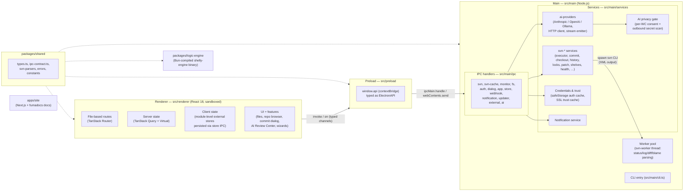

# Architecture

ShellySVN is an Electron app with a strict three-process layout (renderer /
preload / main), a shared types+parsers package, a standalone logic-engine
binary, and a Next.js documentation site. This document describes the current
layering; entry points are defined in `electron.vite.config.ts`.

## Diagram

## Layers

### Renderer (`src/renderer`)

React 18 single-page app, loaded with a strict CSP and sandboxing.

- **Routing**: TanStack Router with file-based routes in `src/renderer/src/routes/`
  (generated route tree committed as `routeTree.gen.ts`).
- **Server state**: TanStack Query, keyed through a shared query-key registry
  (`src/renderer/src/lib/queryKeys.ts`, plus feature-local registries such as
  `features/repo-browser/hooks/queryKeys.ts`) so invalidation is centralized
  after mutations.
- **Client state**: no state-management dependency — stores are module-level
  external stores consumed with `useSyncExternalStore` (e.g. `lib/tabsStore.ts`,
  `features/ai-review-center/reviewCenterStore.ts`), persisted best-effort
  through the `store` IPC bridge with strict parse-on-hydrate.
- **Virtualization**: TanStack Virtual for large file lists and diffs.
- **Features**: feature folders under `src/renderer/src/features/`
  (`ai-review-center`, `repo-browser`, `files`, `branches`,
  `working-copy-command-center`) plus shared dialogs under `components/ui/`
  built on `DialogBase`.

The renderer never touches Node or Electron APIs directly; everything arrives
through the preload bridge.

### Preload (`src/preload`)

The only bridge. `src/preload/index.ts` assembles the typed `window.api`
object from per-domain factories in `src/preload/api/` (`svn`, `ai`, `data`,
`native`, `ipc`) and exposes it via `contextBridge`; context isolation is
mandatory (the preload throws if it is off). The surface is typed as
`ElectronAPI` from `packages/shared/src/types.ts`, so a renderer-visible
change must start in shared types and the corresponding factory — and per the
coordination protocol, `packages/shared/src/types.ts` and `src/preload/api/*.ts`
change **additively only** (existing channels keep their shape; new `ai:*`
streaming events are the example of additive growth).

### Main (`src/main`)

Node.js process owning the filesystem, the SVN client, credentials, and
providers.

- **Entry** (`src/main/index.ts`): single-instance lock, protocol/deep-link
  handler, secure-IPC boundary, approved-path bootstrap, lifecycle/mutation
  shutdown sequencing; registers every IPC domain listed in the diagram.
- **IPC handlers** (`src/main/ipc/`): one module per domain; they validate
  arguments (approved paths, svn target validation) and delegate to services.
- **SVN services** (`src/main/services/svn-*.ts`): build and spawn `svn` CLI
  processes (XML output parsed with `fast-xml-parser`), serialized through
  the working-copy mutation queue; heavy parsing (status/log/diff/blame) is
  offloaded to the worker pool (`src/main/workers/`).
- **AI services**: `ai-providers/` (Anthropic, OpenAI-compatible chat, Ollama,
  with a shared HTTP client and stream emitter that pushes `ai:stream` events
  to the renderer), commit-message/review/plan generation, the repository
  profile store, and the privacy gate (`ai-privacy-scanner.ts`: per-working-copy
  consent + blocking scan of outbound prompts for high-confidence secrets).
- **Credentials & trust**: auth sessions cached in memory, persistent
  credentials encrypted via Electron `safeStorage` when the OS offers it;
  SSL trust decisions cached separately (`ssl-trust-cache.ts`).
- **Also in main**: notification service, file watchers (chokidar, debounced,
  closed when their working copy is removed), app updater, shell integration
  hooks, and the `cli.ts` CLI entry.

### `packages/shared`

Types for the entire IPC surface (`types.ts`, `ipc-contract.ts`), SVN XML
parsers (`svn-parsers.ts`), error shapes (`errors.ts`), and constants. Both
Electron processes, the preload, and the logic engine import from here — it is
the contract layer and the reason the bridge can stay typed.

### `packages/logic-engine`

A standalone SVN operations binary compiled with Bun (`shelly-engine`), used
by the CLI and shipped alongside the app; it shares the SVN client logic via
`@shellysvn/shared` rather than depending on Electron. Built per-platform by
`bun run engine:build:all` and verified by `bun run verify:binaries`.

### `apps/site`

The documentation site (Next.js 16 + fumadocs, MDX content in
`apps/site/content/docs/`). It is a separate workspace with no Electron
dependency; build via `bun run site:build`.

## Process boundaries worth knowing

- **Every mutation is serialized** per working copy (`svn-mutation-queue.ts`);
  shutdown drains active mutations and persists interrupted ones for recovery
  at next launch.
- **Errors are classified, not passed through**: `utils/svn-errors.ts` reduces
  upstream stderr to a category + retryability before the renderer sees it
  (see `docs/troubleshooting.md`).
- **The renderer is untrusted**: approved-path checks, path guards, and the
  secure-IPC boundary in main treat every IPC argument as hostile input.
